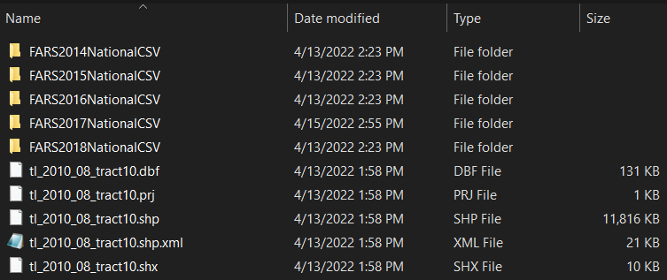

```{r setup, include = FALSE}
knitr::opts_chunk$set(
  collapse = TRUE,
  comment = "#>"
)
```

## Introduction

The purpose of this tutorial is to set up FARS data to create the NCDM traffic safety indicators, including: number of accidents, number of deaths, number of pedestrian deaths, and number of bicyclist deaths. It produces a data frame at the end.

## Getting started 

### Download your data

#### Traffic fatality data

To start, you will need to download your data from the [FARS website](https://www.nhtsa.gov/node/97996/251). Datasets on the site are organized by year. Click on each year of interest, then on *National*, then download a zip file with a name like *FARS2019NationalCSV.zip*. You will need to do this for each year. Later, you will subset your state's data. The code is designed to cycle sequentially through all years you request, so missing years will cause an error. To avoid this, download all years between the earliest and latest year you want to include.

#### Census tract shapefiles

Next, download your state's census tract file from the [US Census website](https://www.census.gov/cgi-bin/geo/shapefiles/index.php). County and census block should also work, but they have not been tested. 

### File structure

The way you save and organize your files is important to successfully process the data. 

Unzip all files to the same folder. The folder should contain the following file structure:



## Process the data in R or RStudio

The code to process the data is short, but depending on the size of your state and the number of years you are processing, it may take a while to run. 

You can create a new R script or project and copy and paste the code below into your file. Areas where you will need to update the script will be indicated in the comments. 

### Prepare the package

First, load the community design package.

The package is not currently hosted on CRAN, the standard R package repository. You will need to install the package from your local machine. 

```{r package, eval=FALSE}
library(cdccommdes)

# to learn more about the package, type 
citation("cdccommdes")        # suggested citation
browseVignettes("cdccommdes") # tutorials and documentation
?cdccommdes                   # help files and about page
```

### Define your settings

Next, define your settings, including file path where your data is located, state specifics, and years.

```{r settings, eval=FALSE}
# my file path
# note the forward slashes (Windows users will need to change them manually)
my_path <- "c:/my_projects/fars"
# my state's census tract shapefile, without the extensions
my_tracts <- "tl_2010_36_tract10"
my_fips <- 36         # state FIPS number
my_years <- 2015:2018 # any vector of years (single years also work)
                      # skipped years are untested
geoid <- "GEOID10"    # shapefile ID number 
```

### Run the function

Last, run the function that will create the indicators. Everything is bundled in the same function to make it easy to use. 

The object produced, `f`, is a data.frame (R lingo for a data table) containing a variable for each traffic safety indicator, plus a couple extra variables like number of accidents for assessment. 

```{r processing, eval=FALSE}
# your custom settings in the previous step will be passed through the function
f <- process_fars(readpath = my_path, shp_name = my_tracts, 
                  years = my_years, tract_id = geoid, my_state = my_fips)
```

### Save your data

A generic save function is included in the package if you want to use it. It can write four types of files: Rds, an R file format, XML, CSV, and shapefiles for spatial data. Users can indicate what kind of files to output by using TRUE or FALSE. The code below outputs all four file types. 

```{r saving, eval=FALSE}
# at this time, the XML file does not incorporate CDC metadata
save_generic(filename = "tract_safety_indicators", dataset = f, 
             savepath = my_path,
             rds = TRUE, xml = TRUE,
             shp = TRUE, csv = TRUE)
```


